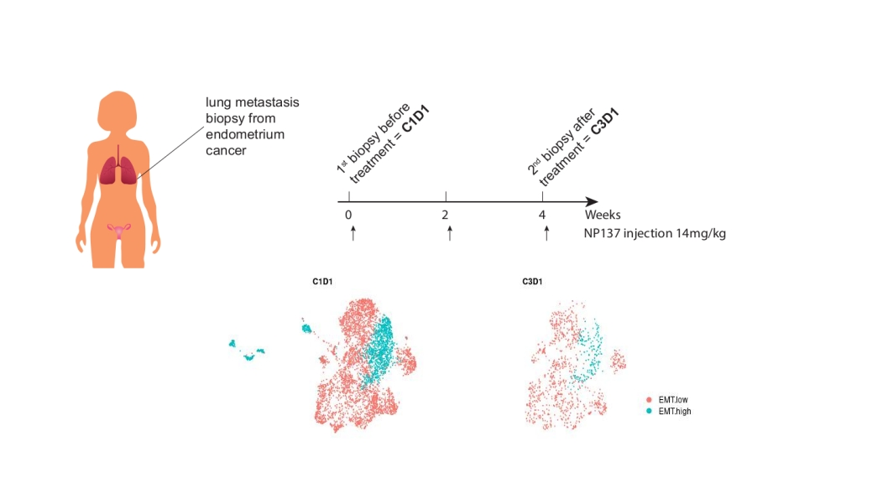

# NP137_single.cell

# 

## Tumor transcriptome response to Netrin-1 blockade.

Code required to reproduce the single-cell RNAseq and spatial transcriptome analyses published in Cassier et al., *"Netrin-1 blockade inhibits tumor growth and EMT features in endometrial cancer"*.

